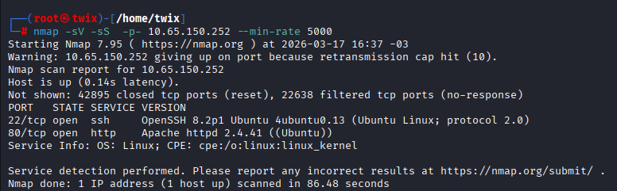
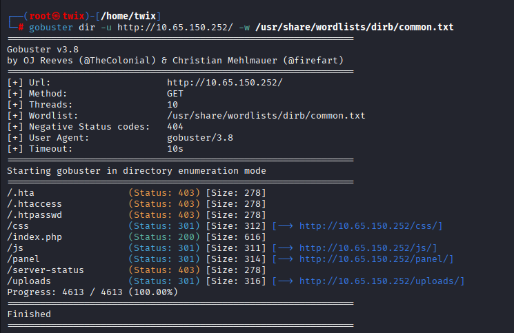
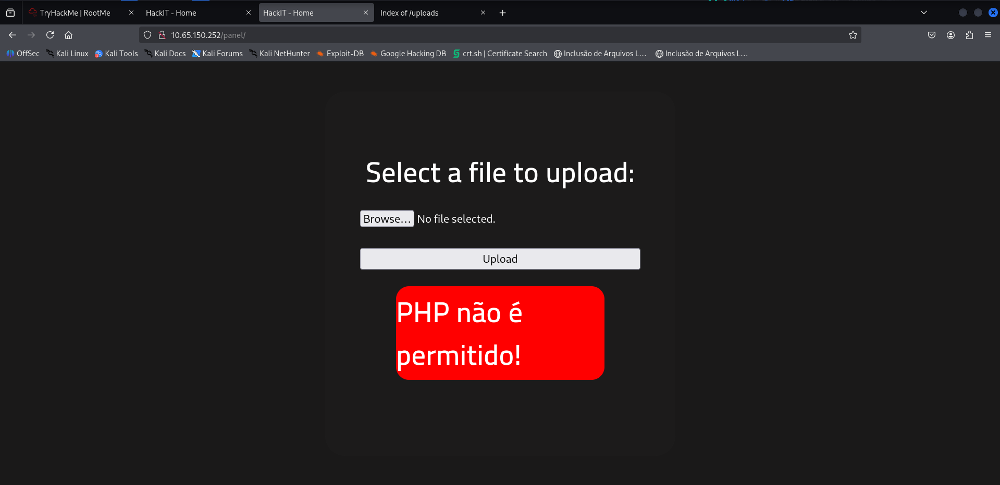
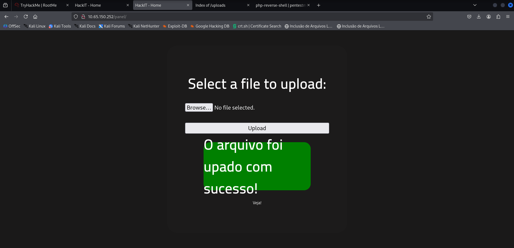
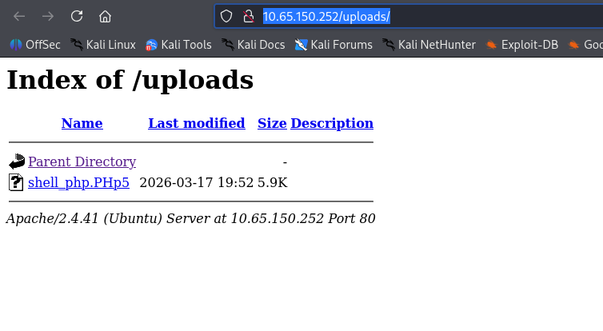
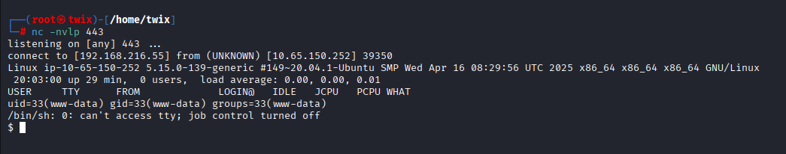
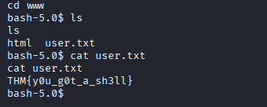
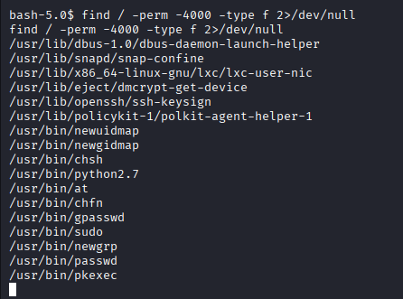
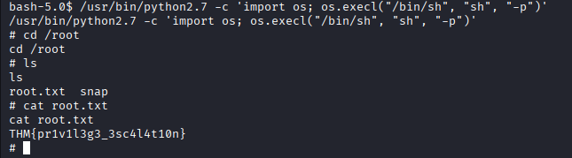

# 🚩 RootMe - TryHackMe Write-up

Documentação técnica da exploração da máquina **RootMe**. Este laboratório foca em técnicas de **Reconhecimento Web**, **Bypass de Upload** e **Escalação de Privilégios em Linux**.

---

## 🔍 1. Reconhecimento & Enumeração

A fase inicial consistiu em identificar portas abertas e serviços ativos no alvo.

* **Nmap Scan:** Identifiquei as portas 22 (SSH) e 80 (HTTP) utilizando varredura com Nmap , utilizei o --min-rate 5000 para um scan mais rapido pois imaginei que esse ctf não teria algum bloqueio ativo.

  

* **Enumeração Web:** Utilizei o `GoBuster` para buscar diretórios ocultos, localizando os caminhos cruciais `/panel/` e `/uploads/` , logo em seguida fiz uma análise detalhada do código-fonte de cada página em busca de comentários ou algo interessante.

  

---

## ⚡ 2. Exploração: Vulnerabilidade de Upload e RCE

O objetivo nesta etapa foi obter a execução remota de código (RCE) através do formulário de upload.

1. **Acesso ao Painel:** Localizei a página de upload onde os arquivos seriam enviados.

   

2. **Tentativa e Proteção:** Ao tentar subir uma shell padrão, o servidor apresentou um bloqueio para a extensão `.php`.

   

3. **Técnica de Bypass:** Alterei a extensão da reverse shell para **.PHp5**, o que permitiu contornar o filtro e realizar o upload.

   

   

4. **Ganho de Acesso:** Preparei o listener com Netcat e executei o arquivo pelo navegador para receber a conexão.

   

   

5. **Flags Iniciais:** Já dentro do sistema, primeiro consegui uma shell melhor com o comando: python -c 'import pty;pty.spawn("/bin/bash")' . Logo em seguida consegui a primeira flag root.txt dentro da pas /var/www .

   

---

## 🚀 3. Escalação de Privilégio (Root)

Com o acesso inicial, busquei elevar meus privilégios para o usuário root.

* **Busca por SUID:** Procurei por binários com permissões especiais e encontrei o Python2.7.

  

* **Elevação Final:** Utilizei o Python para invocar um shell de root e ler a flag final do desafio dentro de /root.

  

---

📝 **Documentação criada por Lucas Arruda Leme**

esta assim
